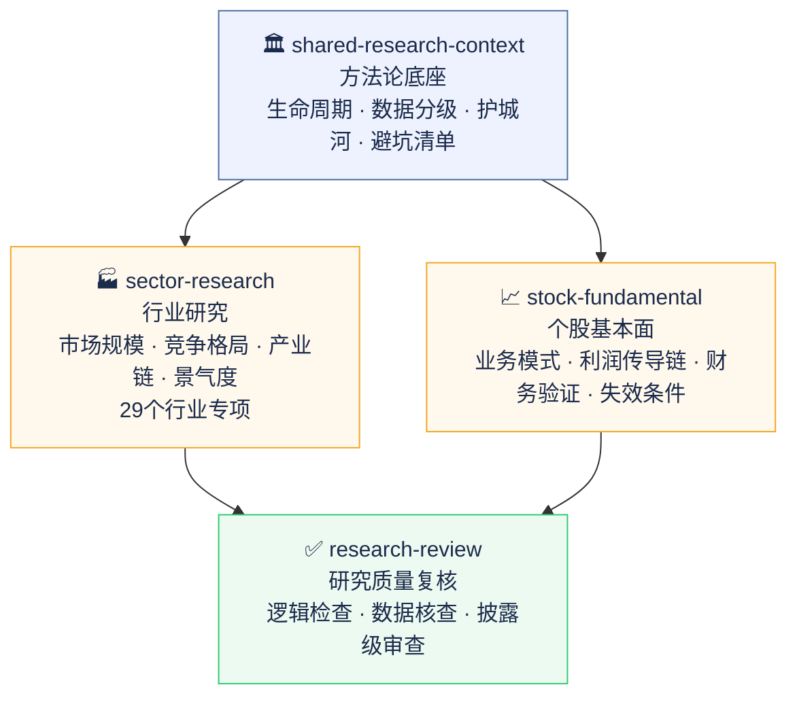
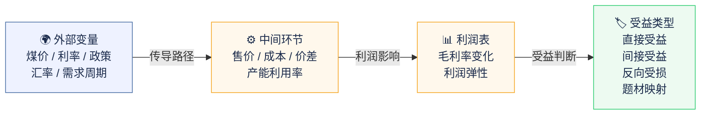
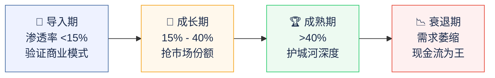

# invest-research · AI 投研 Skill 套件

专为 A 股和港股研究设计的 AI 分析框架。不是提示词模板，是把专业分析师的判断逻辑直接内置进 AI 的工作方式里。


---

## 它解决什么问题

直接让 AI 做投研，通常会遇到两类问题：

**输出质量不稳定。** 同一个问题，今天问得到一份像样的分析，换个时间问，得到的是一篇正确的废话——"竞争格局较为激烈""建议关注行业龙头"，读完等于没读。

**框架用错了。** AI 很容易对所有公司、所有行业套同一套分析逻辑。周期股和消费股的核心分析点完全不同，成长期行业和成熟期行业的估值逻辑完全不同——但 AI 不会自己区分。

这套 skill 的作用不是教 AI 新知识，而是**确保它每次分析都不跳过关键步骤，不用错框架，不给出没有数据支撑的空结论。**

---

## 一个核心原则

> **Skill 告诉 AI 怎么想，不告诉 AI 知道什么。**

AI 已经懂财务分析、懂行业研究、懂宏观逻辑。反复向它解释这些只会让输出更死板。

这套 skill 编码的是判断逻辑：这家公司属于哪类业务结构、利润受什么外部变量驱动、当前方向是顺风还是逆风、什么信号出现时结论应该被推翻。这些是 AI 容易跳过或做得不够细的地方。

这套 skill 经过真实输出的对比测试。有一个模块（宏观研究）在测试后发现有 skill 反而不如没有 skill，直接删掉了。保留下来的，都是测试证明有真实增量价值的。

---

## 模块架构



**分层逻辑：**
- **底座层** 提供所有模块共用的方法论规则，改一处全局生效
- **研究层** 覆盖行业和个股两个分析维度，按需独立触发，也可组合使用
- **质控层** 对输出做显式质量审查，日常自检已静默内嵌在每次分析流程中

---

## 包含四个模块

### 📈 个股基本面分析

分析一家公司值不值得投，业务质量怎么样，财务是否健康。

**利润传导链**



不只是说"公司受煤价影响较大"，而是完整写出：煤价上涨 → 自产煤售价提升 → 吨煤毛利扩大 → 集团利润弹性约 X 亿/百元涨幅。

**逻辑失效条件必须可观测**

每份分析都要给出具体的失效信号，不是"竞争加剧风险"这类说了等于没说的话：

```
✗  竞争加剧导致利润下滑
✓  外卖 GTV 增速连续两季低于 X%，且骑手激励成本占比超历史高点
```

**中国市场特有风险**

输出前自检包含：VIE 架构、国企和民企的治理差异、行业监管周期、大股东减持和股权质押。

---

### 🏭 行业研究

研究一个行业的市场规模、竞争格局、产业链和投资机会。

**生命周期优先**



先判断行业所处阶段，再选对应的分析框架和估值方法。不同阶段的关键指标完全不同，禁止对所有行业套同一套模板。

**数据质量分级**

| 级别 | 来源 | 用途 |
|------|------|------|
| P1 | 官方统计 / 监管披露 | 主证据，决定结论框架 |
| P2 | 行业协会 / 公司年报 | 主证据，验证细分赛道 |
| P3 | 交易数据 / 招投标 | 验证层，捕捉拐点 |
| P4 | 券商研报 / 咨询报告 | 辅助，不能做主证据 |
| P5 | 舆情 / 招聘 / 热搜 | 只能旁证，不能支撑结论 |

覆盖 29 个细分行业的专项分析文件，含每个行业特有的关键指标、领先信号和常见陷阱。

<details>
<summary>查看完整行业列表</summary>

| 板块 | 覆盖行业 |
|------|---------|
| 🛍️ 消费（4） | 白酒、食品饮料、家用电器、美妆/医美 |
| 💊 医药（4） | 创新药、仿制药/集采、医疗器械、CXO |
| 💻 科技（4） | 芯片设计、半导体设备/材料、消费电子、软件/SaaS |
| ⚡ 新能源（5） | 光伏、风电、储能、新能源车、动力电池 |
| 🏭 周期工业（5） | 化工、钢铁/铝、煤炭、有色金属、工程机械 |
| 🏦 金融（3） | 银行、券商、保险 |
| 🌐 其他（4） | 互联网平台、游戏、航空、公用事业/电力 |

</details>

---

### ✅ 研究质量复核

审查一份已有研究报告的逻辑、数据质量和结论完整性。

| 模式 | 适用场景 |
|------|---------|
| 快速检查 | 只查致命错误：定义口径 / 逻辑断层 / 结论空洞 |
| 标准复核 | 9 大维度全项执行 |
| 披露级 | 标准复核 + 每个核心数字溯源，适用于对外发布或融资材料 |

---

### 🏛️ 方法论底座

所有模块共用的基础规则库。包括生命周期判断标准、数据质量分级、市场规模测算方法、护城河分析框架、常见分析陷阱清单等。修改一处，所有模块同步更新。

---

## 为什么把宏观研究模块删掉了

这套 skill 原本有一个完整的宏观研究模块。实际测试对比后发现：**有 skill 的宏观分析反而更差**——AI 开始按步骤走流程，数据具体度和分析深度都不如它自由发挥时的表现。

原因很直接：宏观分析是 AI 训练数据覆盖最充分的领域，它本来就做得好。给它套一套固定流程，反而把它限制住了。这个决定是测出来的，不是猜的。

宏观背景通过两种方式保留：行业研究遇到宏观敏感型行业时展开宏观子分析，个股分析的外部变量传导链要求结合当前实际宏观环境判断方向。

---

## 适用场景

- 分析某只 A 股或港股的基本面
- 研究某个行业的投资机会
- 快速判断一家公司的业务质量和财务健康度
- 审查外部研报的逻辑和数据质量
- 跟踪某类公司在特定宏观环境下的受益情况

**适用平台：** Claude / ChatGPT / Gemini，任何支持自定义 skill 的 AI 平台均可使用。
