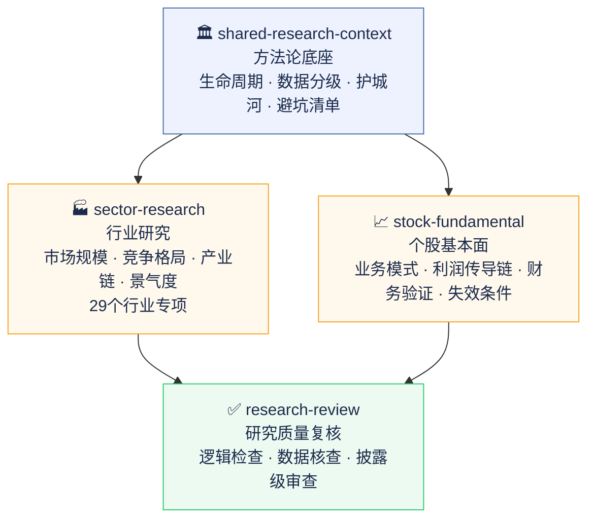
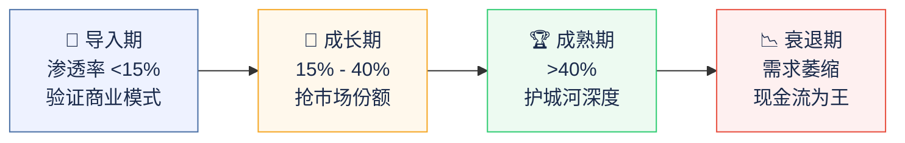
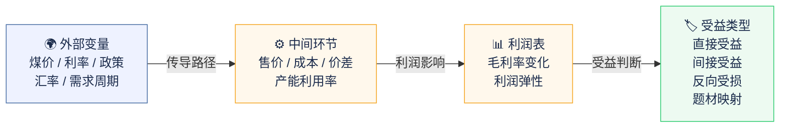

# invest-research · AI 投研 Skill 套件

专为 A 股和港股研究设计的 AI 分析框架。不是提示词模板，是把专业分析师的判断逻辑直接内置进 AI 的工作方式里。


---

## 它解决什么问题

直接让 AI 做投研，通常会遇到两类问题：

**输出质量不稳定。** 同一个问题，今天问得到一份像样的分析，换个时间问，得到的是一篇正确的废话——"竞争格局较为激烈""建议关注行业龙头"，读完等于没读。

**框架用错了。** AI 很容易对所有公司、所有行业套同一套分析逻辑。周期股和消费股的核心分析点完全不同，成长期行业和成熟期行业的估值逻辑完全不同——但 AI 不会自己区分。

这套 skill 的作用不是教 AI 新知识，而是**确保它每次分析都不跳过关键步骤，不用错框架，不给出没有数据支撑的空结论。**

---

## 核心原则

> **Skill 告诉 AI 怎么想，不告诉 AI 知道什么。**

AI 已经懂财务分析、懂行业研究、懂宏观逻辑。反复向它解释这些只会让输出更死板。

这套 skill 编码的是判断逻辑：这家公司属于哪类业务结构、利润受什么外部变量驱动、当前方向是顺风还是逆风、什么信号出现时结论应该被推翻。这些是 AI 容易跳过或做得不够细的地方。

这套 skill 经过真实输出的对比测试，保留下来的都是测试证明有增量价值的部分。

---

## 模块架构



- **底座层** 提供所有模块共用的方法论规则，改一处全局生效
- **研究层** 覆盖行业和个股两个分析维度，按需独立触发，也可组合使用
- **质控层** 对输出做显式质量审查，日常自检已静默内嵌在每次分析流程中

---

## 🏭 行业研究

研究一个行业的市场规模、竞争格局、产业链和投资机会。

### 生命周期优先



先判断行业所处阶段，再选对应的分析框架和估值方法。禁止对所有行业套同一套模板。

### 数据质量分级

| 级别 | 来源 | 用途 |
|------|------|------|
| P1 | 官方统计 / 监管披露 | 主证据，决定结论框架 |
| P2 | 行业协会 / 公司年报 | 主证据，验证细分赛道 |
| P3 | 交易数据 / 招投标 | 验证层，捕捉拐点 |
| P4 | 券商研报 / 咨询报告 | 辅助，不能做主证据 |
| P5 | 舆情 / 招聘 / 热搜 | 只能旁证，不能支撑结论 |

### 29 个行业专项

每个行业内置特有的分析框架、关键指标和常见陷阱，研究对应行业时自动加载。

<details>
<summary><b>🛍️ 消费（4个）</b></summary>

| 行业 | 核心驱动变量 | 关键跟踪指标 |
|------|------------|------------|
| 白酒 | 宴席/商务需求、渠道库存、高端价格带 | 飞天茅台批价、渠道库存天数、动销率 |
| 食品饮料 | 原材料成本（糖/油/包材）、提价能力 | 原料期货价格、出厂价vs终端价价差 |
| 家用电器 | 地产竣工端、出口、铜铝等原材料 | 竣工面积、出口额、铜价 |
| 美妆/医美 | 医美诊疗量、品牌溢价、获客成本 | 医美机构开台率、客单价、复购率 |

</details>

<details>
<summary><b>💊 医药（4个）</b></summary>

| 行业 | 核心驱动变量 | 关键跟踪指标 |
|------|------------|------------|
| 创新药 | 临床进展、医保谈判结果、海外授权（BD） | 关键临床数据、医保谈判降价幅度、BD交易金额 |
| 仿制药/集采 | 集采降价幅度、过评品种数、原料药价格 | 集采中标价、过评进度、原料药价格 |
| 医疗器械 | 集采扩围节奏、院内诊疗量、国产替代 | 集采政策、手术量、国产化率 |
| CXO | 创新药融资环境、大药企研发支出、订单能见度 | 全球Biotech融资额、在手订单、产能利用率 |

</details>

<details>
<summary><b>💻 科技（4个）</b></summary>

| 行业 | 核心驱动变量 | 关键跟踪指标 |
|------|------------|------------|
| 芯片设计 | 下游库存周期、出货量与ASP、先进制程进展 | 渠道库存周数、出货量、制程节点进度 |
| 半导体设备/材料 | 晶圆厂扩产CapEx、国产化率、交付周期 | 国内晶圆厂投资额、设备交付周期、国产替代率 |
| 消费电子 | 手机/PC出货量、零部件价格、新品周期 | 全球手机出货量、BOM成本变化、旗舰发布节奏 |
| 软件/SaaS | ARR增速、净留存率（NRR）、销售效率 | ARR、NRR、Rule of 40 |

</details>

<details>
<summary><b>⚡ 新能源（5个）</b></summary>

| 行业 | 核心驱动变量 | 关键跟踪指标 |
|------|------------|------------|
| 光伏 | 硅料/组件价格、全球装机需求、政策补贴 | 硅料现货价、组件报价、海外装机量 |
| 风电 | 风机招标量、海风推进进度、零部件成本 | 风机招标量、海风核准量、塔筒/叶片价格 |
| 储能 | 碳酸锂价格、项目招标量、系统价格 | 锂价、储能系统报价、招标规模 |
| 新能源车 | 月度销量、电池成本、渗透率趋势 | 月度销量、渗透率、电池Pack价格 |
| 动力电池 | 碳酸锂价格、装车量、产能利用率 | 锂价、装车量、开工率 |

</details>

<details>
<summary><b>🏭 周期工业（5个）</b></summary>

| 行业 | 核心驱动变量 | 关键跟踪指标 |
|------|------------|------------|
| 化工 | 原油价格、产品-原料价差、开工率 | 油价、主要产品价差、开工率 |
| 钢铁/铝 | 铁矿石/煤炭/氧化铝价格、地产需求、出口 | 矿价/煤价、地产新开工、出口量 |
| 煤炭 | 动力煤/焦煤现货价、港口库存、进口量 | 煤价、港口库存天数、月度进口量 |
| 有色金属 | LME铜铝锌价格、库存、美元指数 | LME现货价和库存、TC/RC加工费 |
| 工程机械 | 挖机月度销量、地产/基建投资、海外收入 | 挖机月销量、出口量、开工小时数 |

</details>

<details>
<summary><b>🏦 金融（3个）</b></summary>

| 行业 | 核心驱动变量 | 关键跟踪指标 |
|------|------------|------------|
| 银行 | LPR利率走向、净息差、资产质量 | 净息差、不良率、社融增速 |
| 券商 | 日均成交额、IPO节奏、两融余额 | 市场日均成交额、IPO过会数、两融余额 |
| 保险 | 新单保费、赔付率、投资收益率 | NBV增速、综合成本率、十年国债收益率 |

</details>

<details>
<summary><b>🌐 其他（4个）</b></summary>

| 行业 | 核心驱动变量 | 关键跟踪指标 |
|------|------------|------------|
| 互联网平台 | GMV/GTV增速、用户时长、广告收入、监管政策 | 月活、广告ARPU、佣金率、政策动态 |
| 游戏 | 新游流水、版号审批节奏、海外收入占比 | 新游首月流水、版号数量、海外收入增速 |
| 航空 | 客座率、票价水平、油价、汇率 | RPK、客座率、CASK（单位成本）、油价 |
| 公用事业/电力 | 上网电价、利用小时数、燃料成本 | 利用小时数、电价市场化比例、煤价 |

</details>

---

## 📈 个股基本面分析

分析一家公司值不值得投，业务质量怎么样，财务是否健康。

### 利润传导链



不只是说"公司受煤价影响较大"，而是完整写出：煤价上涨 → 自产煤售价提升 → 吨煤毛利扩大 → 集团利润弹性约 X 亿/百元涨幅。

### 逻辑失效条件必须可观测

每份分析都要给出具体的失效信号，不是"竞争加剧风险"这类说了等于没说的话：

```
✗  竞争加剧导致利润下滑
✓  外卖 GTV 增速连续两季低于 X%，且骑手激励成本占比超历史高点
```

### 中国市场特有风险

输出前自检包含：VIE 架构、国企和民企的治理差异、行业监管周期、大股东减持和股权质押。

---

## ✅ 研究质量复核

审查一份已有研究报告的逻辑、数据质量和结论完整性。

| 模式 | 适用场景 |
|------|---------|
| 快速检查 | 只查致命错误：定义口径 / 逻辑断层 / 结论空洞 |
| 标准复核 | 9 大维度全项执行 |
| 披露级 | 标准复核 + 每个核心数字溯源，适用于对外发布或融资材料 |

---

## 🏛️ 方法论底座

所有模块共用的基础规则库。包括生命周期判断标准、数据质量分级、市场规模测算方法、护城河分析框架、常见分析陷阱清单等。修改一处，所有模块同步更新。

---

## 适用场景

- 需要快速搭建一份结构化行业研究框架时
- 需要分析某个行业的发展阶段、市场空间、竞争格局、产业链和风险时
- 需要把宏观环境纳入行业或资产判断时
- 需要分析具体公司的商业模式、财务健康度、护城河和风险点时
- 需要对已有研究内容做逻辑、数据口径和结论链条复核时
- 需要在较短时间内形成一份更接近专业研究机构口径的分析材料时
- 需要把 AI 纳入日常投研流程，而不是只把它当成信息搜索工具时

**适用平台：** Claude / ChatGPT / Gemini/openclaw，任何支持自定义 skill 的 AI 平台均可使用。
